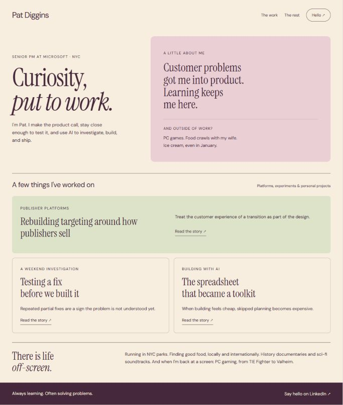
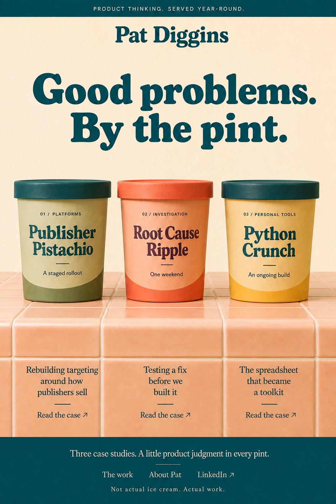

# Personal-site design references

These stills preserve two candidate visual directions for future consideration.
They are proposals, not implementation specifications or approved replacement copy.
The existing site markup, stories, styles, configuration, and runtime are unchanged.

This directory belongs under `_originals/`: Jekyll does not publish that directory.
Keep reference assets here rather than putting them in a live page or asset directory.

## Common Ground

Browser-rendered reference of the retained concept: cream background, plum type,
blush personal introduction, and a pistachio featured case study. The about panel
uses a softly rounded rectangle with even padding, not the earlier arched top.
The captured desktop composition was rendered at a 1024 CSS-pixel viewport.

## Soda Fountain

AI-generated art-direction still: rounded retro display type, teal and vanilla,
and three upright pints resting on a thick peach-tiled counter. There is no metal
trim. The personal name appears at the page masthead only, never on the pints or
lids. Each case has its own link; global navigation is grouped in the teal footer.

The proposed interaction is a half-turn to a nutrition-label-inspired Case Facts
preview, followed by a link to the full case. This image is static; it does not
implement or validate that behavior. Exact production fonts, responsive layout,
accessibility, and any runtime changes require separate implementation review.
